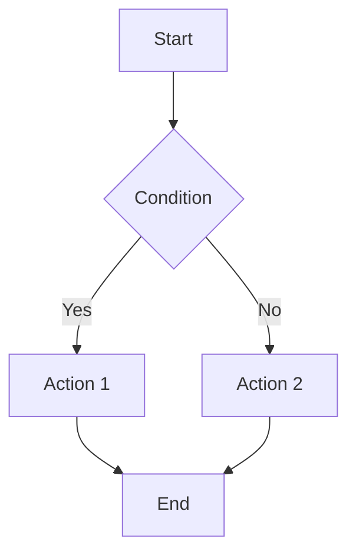

# PRD: [NOME DA FEATURE]

**Feature**: [SHORT_NAME]  
**Branch**: `feature/[SHORT_NAME]`  
**Criado**: [DATA]  
**Status**: Rascunho | Em Revisão | Aprovado

<!--
  CONTRATO DE SAÍDA (não remover; usado pelos workflows):
  - A ordem das seções DEVE ser preservada. Seções obrigatórias: Fluxo Crítico, Cenários e Testes de Usuário, Requisitos (FR/NFR), Critérios de Sucesso, Premissas, Considerações Específicas do Projeto.
  - Status DEVE ser exatamente um de: Rascunho | Em Revisão | Aprovado.
  - Quando um valor não puder ser determinado: use [NEEDS CLARIFICATION: motivo] (máx 3 no total) ou [TBD] em Premissas; não invente valores.
  - Conteúdo principal (excluindo anexos, exemplos, tabelas) ≤ 1.000 palavras.
-->

---

### 📍 Fluxo de Trabalho

```
✅ PRD (atual) → ⭕ TechSpec → ⭕ Tasks → ⭕ Implementação
```

**Próximo passo**: Após aprovação, execute `/specswift.create-techspec`

## Documentação de Referência

| Documento | Conteúdo | Uso |
|-----------|----------|-----|
| `README.md` | Visão geral e comandos | Contexto do projeto |
| `_docs/PRODUCT.md` | Regras de negócio | Validar requisitos funcionais |
| `_docs/STRUCTURE.md` | Arquitetura e pastas | Entender estrutura |
| `_docs/TECH.md` | Stack e padrões | Restrições técnicas |

## Fluxo Crítico *(obrigatório)*

<!--
  AÇÃO REQUERIDA: Descreva o fluxo crítico da feature.
  Você pode usar um fluxograma Mermaid ou descrição textual passo-a-passo.
-->



## Mockups de UI *(se aplicável)*

<!--
  AÇÃO REQUERIDA: Se a feature possui elementos visuais, inclua aqui os mockups gerados.
  Use a ferramenta generate_image para criar visualizações das telas principais.
-->


## Cenários de Usuário & Testes *(obrigatório)*

<!--
  IMPORTANTE: Histórias de usuário devem ser PRIORIZADAS como jornadas de usuário ordenadas por importância.
  Cada história/jornada de usuário deve ser TESTÁVEL INDEPENDENTEMENTE - significando que se você implementar apenas UMA delas,
  você ainda deve ter um MVP (Produto Mínimo Viável) que entrega valor.
  
  Atribua prioridades (P1, P2, P3, etc.) para cada história, onde P1 é a mais crítica.
  Pense em cada história como uma fatia standalone de funcionalidade que pode ser:
  - Desenvolvida independentemente
  - Testada independentemente
  - Implantada independentemente
  - Demonstrada para usuários independentemente
-->

### US1: [Título Breve] (Prioridade: P1)

[Descreva esta jornada do usuário em linguagem simples]

**Por que esta prioridade**: [Explique o valor e por que tem este nível de prioridade]

**Teste Independente**: [Descreva como isso pode ser testado independentemente - ex., "Pode ser totalmente testado por [ação específica] e entrega [valor específico]"]

**Cobertura de Testes**:
- Testes unitários para lógica core (Models/Repositories/ViewModels)
- Testes de UI para jornada crítica do usuário (quando aplicável)

**Considerações Offline/Sincronização**:
- [Online-only / Offline suportado / Semi-offline]
- O que acontece sem conectividade?
- O que acontece durante sincronização / com fila de sincronização pendente?

**Cenários de Aceitação**:

1. **Dado** [estado inicial], **Quando** [ação], **Então** [resultado esperado]
2. **Dado** [estado inicial], **Quando** [ação], **Então** [resultado esperado]

---

### US2: [Título Breve] (Prioridade: P2)

[Descreva esta jornada do usuário em linguagem simples]

**Por que esta prioridade**: [Explique o valor e por que tem este nível de prioridade]

**Teste Independente**: [Descreva como isso pode ser testado independentemente]

**Cobertura de Testes**:
- Testes unitários
- Testes de UI (se esta história muda fluxo visível ao usuário)

**Considerações Offline/Sincronização**:
- [Online-only / Offline suportado / Semi-offline]
- Comportamento de sincronização/pendente (se aplicável)

**Cenários de Aceitação**:

1. **Dado** [estado inicial], **Quando** [ação], **Então** [resultado esperado]

---

### US3: [Título Breve] (Prioridade: P3)

[Descreva esta jornada do usuário em linguagem simples]

**Por que esta prioridade**: [Explique o valor e por que tem este nível de prioridade]

**Teste Independente**: [Descreva como isso pode ser testado independentemente]

**Cobertura de Testes**:
- Testes unitários

**Cenários de Aceitação**:

1. **Dado** [estado inicial], **Quando** [ação], **Então** [resultado esperado]

---

[Adicione mais histórias de usuário conforme necessário, cada uma com prioridade atribuída]

### Casos de Borda

<!--
  AÇÃO REQUERIDA: O conteúdo desta seção representa placeholders.
  Preencha-os com os casos de borda corretos.
-->

- O que acontece quando [condição de borda]?
- Como o sistema lida com [cenário de erro]?
- Persistência e Segurança: [Especifique banco de dados, segurança de thread, migrações]
- Autenticação: [Especifique método de autenticação, expiração de token, armazenamento seguro]
- Ambiente: [Comportamento em diferentes ambientes (Dev/QA/Prod)]

## Requisitos *(obrigatório)*

<!--
  AÇÃO REQUERIDA: O conteúdo desta seção representa placeholders.
  Preencha-os com os requisitos funcionais corretos.
-->

### Requisitos Funcionais

- **FR-001**: Sistema DEVE [capacidade específica, e.g., "permitir que os usuários criem contas"]
- **FR-002**: Sistema DEVE [capacidade específica, e.g., "validar endereços de e-mail"]  
- **FR-003**: Usuários DEVEM ser capazes de [interação-chave, e.g., "redefinir suas senhas"]
- **FR-004**: Sistema DEVE [requisito de dados, e.g., "persistir preferências do usuário"]
- **FR-005**: Sistema DEVE [comportamento, e.g., "registrar todos os eventos de segurança"]

*Considerações do Projeto para requisitos:*

- Se os dados são armazenados localmente, especifique a tecnologia e se afeta schema/migração.
- Se a navegação muda, especifique o padrão de navegação (ex: Coordinators, Router, etc).
- Se houver fluxo offline ou sincronização, especifique o comportamento esperado.

*Exemplo de marcação de requisitos não claros:*

- **FR-006**: Sistema DEVE autenticar usuários via [PRECISA ESCLARECIMENTO: método de autenticação não especificado - e-mail/senha, SSO, OAuth?]
- **FR-007**: Sistema DEVE reter dados do usuário por [PRECISA ESCLARECIMENTO: período de retenção não especificado]

### Entidades-Chave *(inclua se a feature envolve dados)*

- **[Entidade 1]**: [O que representa, atributos-chave sem implementação]
- **[Entidade 2]**: [O que representa, relacionamentos com outras entidades]

<!--
  Se estas entidades são persistidas, note a tecnologia de persistência e se mudanças de schema/migrações são necessárias.
-->

### Requisitos Não-Funcionais *(inclua se aplicável)*

- **NFR-001**: Performance - [ex., "Tela deve carregar em menos de 2 segundos"]
- **NFR-002**: Acessibilidade - [ex., "Suporte completo a VoiceOver e Dynamic Type"]
- **NFR-003**: Segurança - [ex., "Dados sensíveis devem ser armazenados no Keychain"]

## Critérios de Sucesso *(obrigatório)*

<!--
  AÇÃO REQUERIDA: Defina critérios de sucesso mensuráveis.
  Estes devem ser agnósticos de tecnologia e mensuráveis.
-->

### Resultados Mensuráveis

- **SC-001**: [Métrica mensurável, ex., "Usuários podem completar criação de conta em menos de 2 minutos"]
- **SC-002**: [Métrica mensurável, ex., "Sistema trata 1000 usuários concorrentes sem degradação"]
- **SC-003**: [Métrica de satisfação do usuário, ex., "90% dos usuários completam tarefa principal com sucesso na primeira tentativa"]
- **SC-004**: [Métrica de negócio, ex., "Reduzir tickets de suporte relacionados a [X] em 50%"]

## Suposições *(obrigatório)*

<!--
  Documente suposições feitas durante a especificação.
  Estas devem ser validadas antes da implementação.
-->

- [Suposição 1 - ex., "Usuário já está autenticado ao acessar esta feature"]
- [Suposição 2 - ex., "Dados de sincronização estão disponíveis no servidor"]

## Dependências *(inclua se aplicável)*

<!--
  Liste dependências externas ou internas necessárias para esta feature.
-->

- [Dependência 1 - ex., "API de autenticação v2 deve estar disponível"]
- [Dependência 2 - ex., "Feature X deve estar implementada primeiro"]

## Perguntas Abertas *(remova quando resolvidas)*

<!--
  Liste perguntas que precisam ser respondidas antes da implementação.
  Remova esta seção quando todas as perguntas forem resolvidas.
-->

- [ ] [Pergunta 1]
- [ ] [Pergunta 2]

---

## Considerações Específicas do Projeto *(obrigatório)*

<!--
  CRÍTICO: Verificar itens específicos do projeto descritos em _docs/PRODUCT.md e _docs/TECH.md.
-->

### Fluxos de Dados e Sincronização

| Fase | Comportamento Esperado |
|------|------------------------|
| **Online** | [Comportamento padrão] |
| **Offline** | [Feature funciona sem conectividade?] |
| **Sincronização** | [Comportamento durante a sincronização?] |

### Segurança e Acesso

- [ ] Requisitos de autenticação/autorização específicos?
- [ ] Tratamento de dados sensíveis?
- [ ] Regras de negócio transversais (ex: permissões, horários)?

